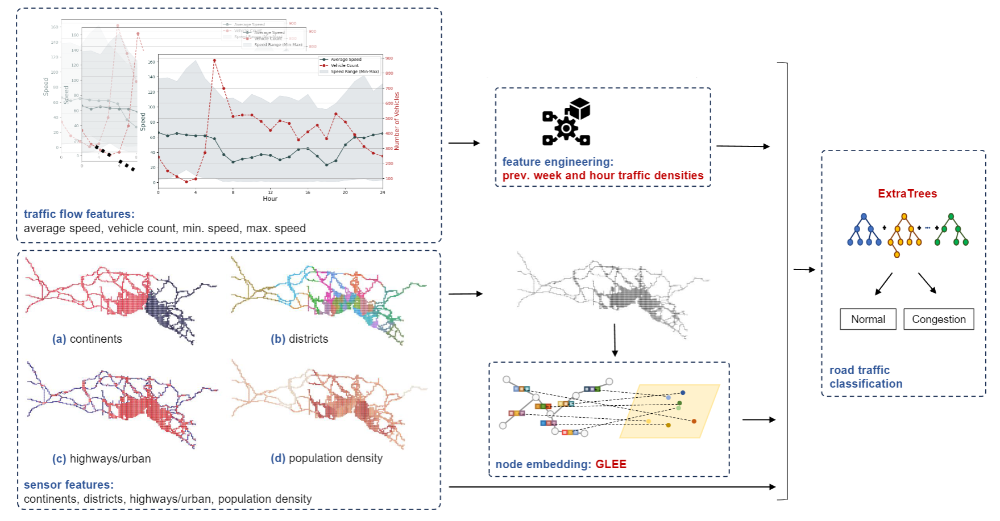

# IBB Traffic

You can access presentation file [here](https://drive.google.com/file/d/1NZ2Jpnc2JyasNjdPwZ3UyRHgcX94s0XD/view?usp=drive_link).


(repo has net been completed yet, you can treat as demo for now.)
This work aims to enrich the traffic prediction field with a new big-scale traffic dataset. The proposed dataset contains 4-years of data collected by 2451 distinct road sensors in Istanbul, Turkey. Dataset contains static node (sensor) features as well as traffic flow features. For now, only one month of dataset is available in this repository. You can access all dataset (containing 4-years of data, and not preprocessed) from the original website of IBB (https://data.ibb.gov.tr/dataset/hourly-traffic-density-data-set).

For preprint of paper: **IBB Traffic Graph Data: Benchmarking and Road Traffic Prediction Model**



## Introduction
For each sensor location (or node), our code aims to predict whether to a congestion will occur in next timestamp given graph structure (via node embeddings), static node features (geographical features for sensors), and previous traffic flow information. After getting node embeddings using different methods (Node2Vec, GLEE, NetMF, GraphWave), we make predictions using different classification models (mostly tree-based). The best result is obtained with combination of GLEE and ExtraTree.

## Quich Start
1. Use **'create_embeddings.py'** file to create node embeddings with different methods. 

```bash
python get_embeddings.py --timestamp 1 --method netmf --length 4
```

2. Use **'run_experiments.py'** file to conduct experiments of different scenarios. Remember that the node embeddings must be created beforehand as in the step 1.
```bash
python run_experiments.py --timestamp 200 --emb-method netmf --emb-size 4 --use-node-embeddings --use-traffic-feats


For citation:

```bibtex
@misc{olug2024ibbtrafficgraphdata,
      title={IBB Traffic Graph Data: Benchmarking and Road Traffic Prediction Model}, 
      author={Eren Olug and Kiymet Kaya and Resul Tugay and Sule Gunduz Oguducu},
      year={2024},
      eprint={2408.01016},
      archivePrefix={arXiv},
      primaryClass={cs.LG},
      url={https://arxiv.org/abs/2408.01016}, 
}
```
